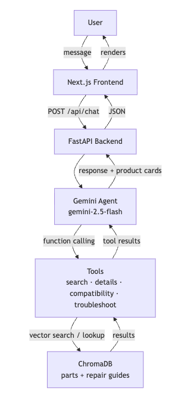

# Architecture Overview

## System Diagram

## Request Lifecycle

1. User types a message in `ChatWindow.tsx`
2. The full conversation history is sent to `POST /api/chat`
3. FastAPI validates the request and calls `run_agent(messages)`
4. The agent creates a Gemini chat session with the conversation history and system prompt
5. Gemini responds — either with plain text (done) or one or more function calls
6. For each function call, the corresponding Python tool runs against ChromaDB
7. Tool results are sent back to Gemini as function response parts
8. Steps 5–7 repeat up to 5 times (tool-calling loop)
9. The final text response and any product cards extracted from tool results are returned to the frontend
10. `ChatWindow.tsx` renders the message bubble and product card row

## The Four Agent Tools

| Tool | Purpose | ChromaDB collection |
|---|---|---|
| `search_parts` | Semantic search for parts by natural language | `parts` |
| `get_part_details` | Full details for a specific part number | `parts` |
| `check_compatibility` | Is part X compatible with model Y? | `parts` |
| `troubleshoot` | Repair guide search by symptom description | `repair_guides` |

### Tool selection is fully delegated to the LLM

The agent does not use keyword matching or routing rules to decide which tool to call. Gemini reads the user's message and the tool descriptions and decides which tool(s) to invoke, in what order, and with what arguments. This means:

- A question like "my ice maker is broken" automatically triggers `troubleshoot`
- A question like "how do I install PS11765620" triggers `get_part_details`
- A question like "is PS11765620 compatible with my 10672002011" triggers `check_compatibility`
- A multi-part question can trigger multiple tools in sequence within one response

## Scope Enforcement

The system prompt explicitly constrains the agent to refrigerator and dishwasher parts only. Out-of-scope questions (e.g. "what is the capital of France") are declined without calling any tools, keeping quota usage low.

## Product Card Extraction

Product cards are not rendered by the LLM — they are extracted from raw tool results before the response is returned. The `_extract_products` function scans all tool result payloads accumulated during the tool-calling loop and deduplicates by part number. This means cards appear even if the LLM's text response doesn't explicitly enumerate the parts.
